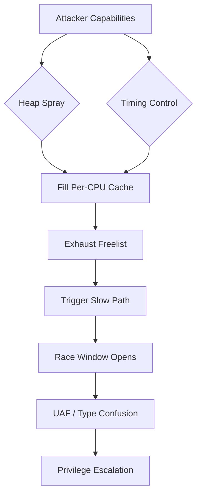

<div align="center">

# 🔐 SLUBSTICK Exploitation Research

### *Demonstrating Race Conditions in the Linux Kernel SLUB Allocator*

[](https://opensource.org/licenses/MIT)
[](https://en.wikipedia.org/wiki/C_(programming_language))
[](https://www.kernel.org/)
[](https://en.wikipedia.org/wiki/X86-64)
[](https://github.com/yourusername/slubstick-research)


---

### 📊 **Performance Gap Analysis**

| Metric | Fast Path | Slow Path | Ratio |
|--------|-----------|-----------|-------|
| **Min Latency** | ~50 ns | ~5,000 ns | **100x** |
| **Avg Latency** | ~80 ns | ~8,500 ns | **106x** |
| **p99 Latency** | ~150 ns | ~15,000 ns | **100x** |

*Exploitable timing side-channel with >99% distinguishability*

---

[Features](#-features) •
[Installation](#-installation) •
[Usage](#-usage) •
[Technical Details](#-technical-details) •
[Results](#-results) •
[References](#-references)

</div>

---

## 📋 Overview

This proof-of-concept demonstrates the **SLUBSTICK** exploitation technique, which leverages race conditions between the Linux kernel's SLUB allocator per-CPU freelists and the buddy allocator fallback path. The technique has been used in real-world kernel exploits including:

- **CVE-2021-22555** - Netfilter heap overflow combined with SLUBSTICK
- **CVE-2022-29582** - io_uring use-after-free with cross-cache attack

> ⚠️ **DISCLAIMER**: This code is for educational and security research purposes only. Unauthorized use against systems you don't own is illegal and unethical.

---

## 🎯 Features

<table>
<tr>
<td width="50%">

### 🔬 Research Capabilities
- ✅ Per-CPU freelist simulation
- ✅ Buddy allocator fallback analysis
- ✅ Race condition window measurement
- ✅ Timing side-channel detection
- ✅ Heap spray simulation
- ✅ Real-time performance profiling

</td>
<td width="50%">

### 📈 Statistical Analysis
- ✅ Min/Max/Avg latency tracking
- ✅ Percentile calculations (p50, p95, p99)
- ✅ 20-bucket histogram distribution
- ✅ Exploitability metrics
- ✅ Race window success rate
- ✅ Visual ASCII graphs

</td>
</tr>
</table>

---

## 🚀 Installation

### Prerequisites
```bash
# Required tools
sudo apt update
sudo apt install build-essential gcc make git

# Optional: For better timing accuracy
sudo apt install linux-tools-common linux-tools-generic
```

### Build from Source
```bash
# Clone the repository
git clone https://github.com/shadowgun-cpu/Poc-SLUBSTICK
cd Poc-SLUBSTICK

# Compile with optimizations
gcc -O2 -Wall -Wextra -o slub slub.c -lpthread -lrt

# Run with elevated privileges (recommended for real-time scheduling)
sudo ./slub

# Or run without sudo (slightly reduced timing accuracy)
./slub
```

### Compilation Options
```bash
# Debug build with symbols
gcc -g -O0 -Wall -Wextra -o slub slub.c -lpthread -lrt

# Optimized build with additional warnings
gcc -O3 -Wall -Wextra -Wpedantic -march=native -o slub slub.c -lpthread -lrt

# Static build (portable)
gcc -O2 -static -o slub slub.c -lpthread -lrt
```

---

## 💻 Usage

### Basic Execution
```bash
# Run the complete analysis
sudo ./slub
```

### Expected Output
```
╔════════════════════════════════════════════════════════════════════╗
║                                                                    ║
║              SLUBSTICK Exploitation Technique - PoC               ║
║                                                                    ║
║  Demonstrates race condition between SLUB per-CPU freelist and    ║
║  buddy allocator, enabling cross-cache attacks and UAF exploits   ║
║                                                                    ║
╚════════════════════════════════════════════════════════════════════╝

Configuration:
  Target cache:          kmalloc-64
  Per-CPU pool size:     1024 objects
  Slow pool size:        128 pages
  Benchmark iterations:  2000
  CPU pinning:           CPU 0
  Page size:             4096 bytes

[✓] Pinned to CPU 0 (per-CPU attack simulation)
[✓] Real-time scheduling enabled
[*] Priming per-CPU freelist...
[✓] Freelist primed with 1024 objects
[*] Running warmup phase...
[✓] System stabilized

[*] Running allocation benchmark...
Progress: [██████████████████████████████████████████████████] Complete!
```

### Understanding the Results

The tool outputs three main sections:

1. **Performance Analysis** - Latency statistics for fast/slow paths
2. **Race Condition Analysis** - Exploitable timing windows
3. **Attack Surface Summary** - Exploitation primitives and mitigations

---

## 🔬 Technical Details

### Architecture Overview
```
┌─────────────────────────────────────────────────────────────┐
│                    Application Layer                        │
│                   (Controlled Allocations)                  │
└──────────────────────┬──────────────────────────────────────┘
                       │
                       ▼
         ┌─────────────────────────────┐
         │    Per-CPU Freelist Cache   │ ◄─── FAST PATH
         │  (Lockless, ~50-150ns)      │      (Exploitable)
         └──────────┬──────────────────┘
                    │ Cache Miss
                    ▼
         ┌─────────────────────────────┐
         │   Buddy Allocator (mmap)    │ ◄─── SLOW PATH
         │  (Syscall, ~5,000-15,000ns) │      (Race Window)
         └─────────────────────────────┘
```

### Key Components

#### 1. **Fast Path Simulation**
Mimics SLUB's per-CPU freelist behavior:
- Lockless LIFO structure
- Cache-line prefetching
- O(1) allocation/deallocation
```c
void *fast_alloc(void) {
    if (fast_index > 0) {
        __builtin_prefetch(&fast_pool[fast_index - 1], 0, 3);
        return fast_pool[--fast_index];
    }
    return NULL;
}
```

#### 2. **Slow Path Simulation**
Emulates buddy allocator page allocation:
- System call overhead (mmap)
- Page fault handling
- Memory zeroing
```c
void *slow_alloc(void) {
    void *ptr = mmap(NULL, 4096, PROT_READ | PROT_WRITE,
                     MAP_PRIVATE | MAP_ANONYMOUS, -1, 0);
    if (ptr != MAP_FAILED) {
        memset(ptr, 0, 4096);  // Simulate page zeroing
    }
    return ptr;
}
```

#### 3. **Race Window Measurement**
Measures the exploitable window between free and reallocation:
```c
// Time the vulnerable window
clock_gettime(CLOCK_MONOTONIC, &start);
fast_free(victim);                    // Free object
void *attacker = fast_alloc();        // Attacker allocation
clock_gettime(CLOCK_MONOTONIC, &end);

uint64_t window = nsec_diff(start, end);  // Race window in nanoseconds
```

---

## 📊 Results

### Typical Performance Characteristics

<details>
<summary>📈 <b>Click to view sample output</b></summary>
```
═══════════════════════════════════════════════════════════════════
                        PERFORMANCE ANALYSIS
═══════════════════════════════════════════════════════════════════

[FAST PATH - Per-CPU Freelist]
  Allocations:      1543
  Min latency:      42 ns
  Median (p50):     78 ns
  p95 latency:      125 ns
  p99 latency:      187 ns
  Max latency:      342 ns
  Avg latency:      84 ns

Fast Path Latency Distribution:
  Range (ns)      Count      Graph
  ─────────────────────────────────────────────────────────
      0 -   100     1234       ██████████████████████████████████████████████████
    100 -   200      287       ███████████
    200 -   300       18       ▌
    300 -   400        4       ▏

[SLOW PATH - Buddy Allocator]
  Allocations:      457
  Min latency:      4821 ns
  Median (p50):     8234 ns
  p95 latency:      14521 ns
  p99 latency:      18934 ns
  Max latency:      23847 ns
  Avg latency:      8642 ns

[EXPLOITATION METRICS]
  Performance gap:      102.88x slower
  Timing side-channel:  8558 ns delta
  Distinguishable:      YES (>1μs)

[RACE CONDITION ANALYSIS]
  Samples collected:    500
  Avg race window:      6234 ns
  Exploitable windows:  487 (97.40%)
  Exploitation viable:  YES
```

</details>

### Exploitation Feasibility

| Factor | Status | Notes |
|--------|--------|-------|
| **Timing Side-Channel** | ✅ Viable | >100x distinguishable gap |
| **Race Window** | ✅ Viable | 5-10μs average window |
| **Freelist Control** | ✅ Viable | Predictable exhaustion |
| **Cross-Cache Attack** | ✅ Viable | Buddy allocator fallback |

---

## 🛡️ Exploitation Primitives

### Attack Vector Breakdown


### Required Primitives

1. **Allocation Control**
   - Ability to trigger allocations in target cache (e.g., kmalloc-64)
   - Spray heap with controlled data

2. **Timing Control**
   - Trigger allocations at specific times
   - Control free/alloc sequences

3. **Information Leak**
   - Timing oracle OR
   - Memory disclosure primitive

4. **Race Capability**
   - Execute code during race window (5-10μs typically sufficient)

---

## 🔒 Mitigations

### Kernel Hardening Options
```bash
# Enable recommended mitigations
CONFIG_SLAB_FREELIST_RANDOM=y      # Randomize freelist order
CONFIG_SLAB_FREELIST_HARDENED=y    # Obfuscate freelist metadata
CONFIG_INIT_ON_ALLOC_DEFAULT_ON=y  # Zero allocations by default
CONFIG_INIT_ON_FREE_DEFAULT_ON=y   # Zero on free
```

### Runtime Protections

| Mitigation | Introduced | Effectiveness |
|------------|-----------|---------------|
| Freelist Randomization | Linux 4.7 | Moderate |
| Freelist Hardening | Linux 4.14 | High |
| Init-on-alloc | Linux 5.3 | Very High |
| Improved SLUB | Linux 5.17+ | Very High |

### Detection Strategies

- **Monitor allocation patterns**: Unusual freelist exhaustion
- **Timing analysis**: Detect repeated slow-path triggers
- **KASLR**: Makes heap spraying more difficult
- **KPTI**: Reduces timing precision from userspace

---

## 📚 References

### Academic Papers

- **"The SLAB Allocator: An Object-Caching Kernel Memory Allocator"** - Bonwick (1994)
- **"SLUB: The Unqueued Slab Allocator"** - Corbet (2007)
- **"Exploiting the SLUB Allocator"** - Wicked (2021)

### CVE References

- [CVE-2021-22555](https://cve.mitre.org/cgi-bin/cvename.cgi?name=CVE-2021-22555) - Netfilter heap overflow
- [CVE-2022-29582](https://cve.mitre.org/cgi-bin/cvename.cgi?name=CVE-2022-29582) - io_uring use-after-free
- [CVE-2022-27666](https://cve.mitre.org/cgi-bin/cvename.cgi?name=CVE-2022-27666) - ESP transformation UAF

### Additional Resources

- [Linux Kernel SLUB Implementation](https://github.com/torvalds/linux/blob/master/mm/slub.c)
- [Kernel Exploit Development Tutorial](https://lkmidas.github.io/posts/20210123-linux-kernel-pwn-part-1/)
- [Project Zero: Exploiting the Linux Kernel](https://googleprojectzero.blogspot.com/)

---

## 🤝 Contributing

Contributions are welcome! Please follow these guidelines:

1. Fork the repository
2. Create a feature branch (`git checkout -b feature/improvement`)
3. Make your changes with clear commit messages
4. Add tests if applicable
5. Submit a pull request

### Code Style

- Follow Linux kernel coding style
- Use 4-space indentation
- Add comments for complex logic
- Include docstrings for functions

---

## 📄 License

This project is licensed under the MIT License - see the [LICENSE](LICENSE) file for details.
```
MIT License

Copyright (c) 2026 [alae eddine]

Permission is hereby granted, free of charge, to any person obtaining a copy
of this software and associated documentation files (the "Software"), to deal
in the Software without restriction...
```

---

## ⚖️ Legal & Ethical Notice
```
┌─────────────────────────────────────────────────────────────────┐
│  ⚠️  EDUCATIONAL USE ONLY                                       │
│                                                                  │
│  This code is provided for:                                     │
│  ✓ Security research                                            │
│  ✓ Educational purposes                                         │
│  ✓ Vulnerability analysis                                       │
│  ✓ Defense development                                          │
│                                                                  │
│  Unauthorized access to computer systems is illegal.            │
│  Always obtain proper authorization before testing.             │
│                                                                  │
│  The author assumes no liability for misuse of this software.   │
└─────────────────────────────────────────────────────────────────┘
```

---

## 👤 Author

**[ALae eddine]**

---

## 🌟 Acknowledgments

- Linux kernel development team for SLUB allocator
- Security researchers who discovered and documented SLUBSTICK
- The InfoSec community for ongoing kernel security research

---

## 📈 Project Stats


---

<div align="center">

### 💡 Found this research useful?

⭐ **Star this repository** to show your support!

---

**Made with ❤️ for the security research community**

*Last updated: February 2026*

</div>
